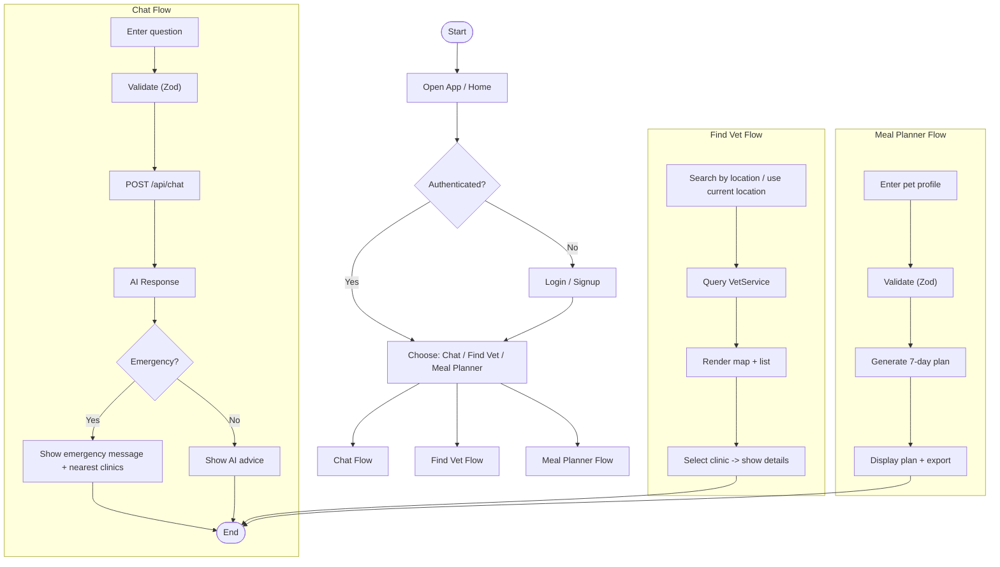
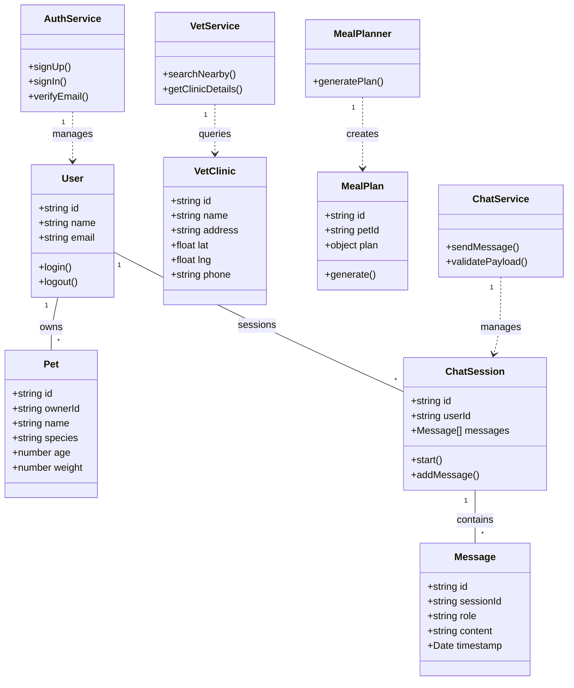

# Vetify Test-Driven Development (TDD) Plan

This document outlines the testing strategy for Vetify. We follow a "Test-First" approach to ensure every feature works exactly as described in our PRD.

---

## 1. What is TDD?

Test-Driven Development (TDD) means we write a "test" (a mini-check) for a feature **before** we write the actual code.

1. **Red**: Write a test that fails (because the feature doesn't exist yet).
2. **Green**: Write just enough code to make the test pass.
3. **Refactor**: Clean up the code to make it professional.

---

## 2. Core Test Scenarios

### 2.1 AI Safety & Fallback (Priority: High)

- **Test Case 1:** User asks "What can dogs eat?".
  - **Expected Result:** AI provides a helpful list of safe foods.
- **Test Case 2:** User asks "My cat is vomiting blood".
  - **Expected Result:** AI must reply with "Contact a professional veterinarian doctor" and return data for the nearest clinic.
- **Test Case 3:** User asks a complex medical question.
  - **Expected Result:** AI identifies complexity and triggers the fallback message.

### 2.2 Smart Vet Locator (Geospatial)

- **Test Case 1:** System receives user coordinates (Latitude/Longitude).
  - **Expected Result:** System returns a list of clinics within a 10km radius.
- **Test Case 2:** User is in a remote area with no clinics nearby.
  - **Expected Result:** System returns a friendly message: "No clinics found nearby, showing the closest ones in your region."

### 2.3 Meal Planner Logic

- **Test Case 1:** Input: Dog, 5 years old, 20kg, no allergies.
  - **Expected Result:** A 7-day plan with appropriate calorie counts.
- **Test Case 2:** Input: Cat, allergic to fish.
  - **Expected Result:** A meal plan that contains 0% fish ingredients.

### 2.4 Anatomy Feature

- **Test Case 1:** User clicks on "Heart" for "Dog".
  - **Expected Result:** System returns correct biological description and health tips for a dog's heart.

---

## 3. Testing Tools

- **Backend:** `pytest` (for checking the logic and AI responses).
- **Frontend:** `Jest` and `React Testing Library` (for checking the buttons and maps).
- **AI Validation:** `LangSmith` (to monitor if the AI is giving safe advice).

---

## 4. How to Run Tests

_(To be updated once code is implemented)_

```bash
# Example command to run backend tests
pytest
```

---

## 5. TDD Strategy and Coverage (Detailed)

This section expands the core test scenarios into concrete, actionable tests (unit, integration, E2E), priorities, and acceptance criteria.

5.1 Prioritization

- **P0 (Critical):** AI safety & escalation, auth flows, chat API validation, vet locator correctness.
- **P1 (High):** Meal planner correctness, basic profile management, map rendering.
- **P2 (Medium):** Blogs, anatomy content, UI polish, accessibility checks.

  5.2 Test Types & Responsibilities

- **Unit tests:** Pure logic—meal calculation, emergency-detection rules, Zod schema tests, utility functions. (Backend: pytest/pytest-mock or Node: vitest)
- **Integration tests:** Chat API with mocked AI client; vet locator queries over test data; auth complete flows with supabase test instance or mocked responses.
- **E2E tests:** User flows using Playwright—signup, ask chat question, find vet, generate meal plan.
- **Contract tests:** Ensure frontend and API agree on request/response schemas (use the Zod schemas exposed in `src/lib/schemas.ts` as single source-of-truth).

  5.3 Example Test Matrix (Representative)

- Unit: `signup` Zod validation (pass/fail), password-strength utils (edge cases), meal calorie calc (range checks).
- Integration: `POST /api/chat` with invalid payload -> 400 + issues; valid payload -> calls AI client (mocked) and returns structured response.
- E2E: Playwright flow: Sign up -> Ask a non-emergency question -> Receive answer -> No escalation shown.

  5.4 Acceptance Criteria (per story)

- Each user story must include at least one unit test and one integration or E2E test where applicable. Story is done when tests pass in CI and code reviewed.

---

## 6. Activity Diagram (High-level user flows)



---

## 7. Class Diagram (Domain model)



---

## 8. Test Implementation Notes

- Use the Zod schemas in `src/lib/schemas.ts` as contract tests: import them in both frontend unit tests and backend integration tests. This ensures schema parity.
- For AI tests:
  - Create a small fixture set of common/non-emergency/emergency prompts and expected behaviors.
  - Mock the external AI client (LangSmith / Gemini wrapper) for CI to assert behavior and logging.
- For Vet Locator:
  - Use deterministic test data for geospatial queries (fixtures) so radius checks are reliable.
- For E2E:
  - Use Playwright to run critical flows in CI with a seeded test database.

## 9. CI Recommendations

- Run unit tests first (fast). On success run integration tests (mocking external services). Run a small subset of E2E tests (smoke) on every PR; full E2E on main branch or nightly.
- Fail builds on schema contract mismatches.

---

If you want, I can now:

- generate test scaffolding files (Zod tests, example pytest/pytest-mock fixtures, Playwright flows), or
- expand the emergency-detection rules into a canonical list with regex/keyword heuristics for implementation.
