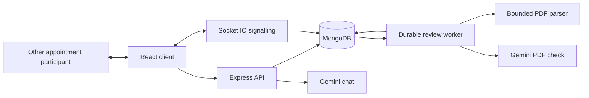
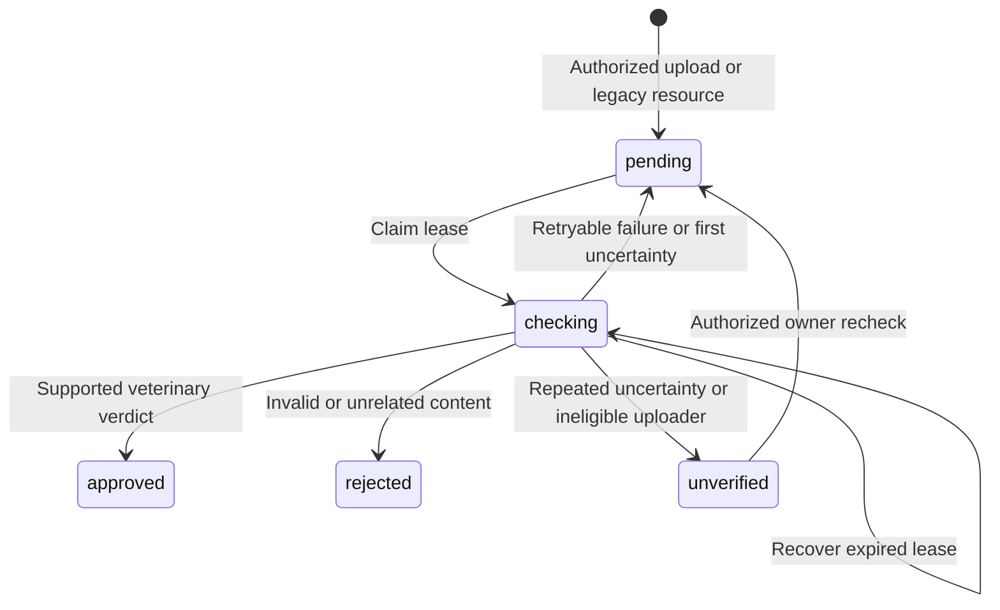

# Vetify Technical Design and Test-Driven Development Plan

Updated: 2 October 2026. This retains the repository's test-driven-development purpose and adds design boundaries for the revised [PRD](PRD.md) and [business idea](business-idea.md). Older Word exports are historical snapshots. Proposed architecture and checks are separated from existing behavior.

## 1. Development approach

For new business logic or regressions, write a meaningful failing acceptance test, implement the behavior, and refactor while keeping it green. This is the intended workflow, not a claim that every existing feature was developed test-first. Avoid tests that merely mirror implementation or require unit tests for copy changes.

Priorities: **P0** authorization, privacy, accounting, payment integrity, unsafe publication; **P1** core journeys, feeding correctness, external-service failures, responsive usability; **P2** supplementary learning and polish. Model relevance and clinical behavior require reviewed evaluations beyond deterministic tests.

## 2. Current architecture

| Layer      | Implementation                                                                                              |
| ---------- | ----------------------------------------------------------------------------------------------------------- |
| Client     | React 18, Vite 5, TypeScript, React Router, React Query, Tailwind, Leaflet, Recharts                        |
| API        | Express 5 and TypeScript, routes under `/api/v1`                                                            |
| Database   | MongoDB official driver; no active Prisma/PostgreSQL or FastAPI backend                                     |
| Validation | Zod and feature contracts under `src/shared`                                                                |
| Auth       | HS256 bearer access token, hashed opaque refresh token, HTTP-only refresh cookie; server role/status checks |
| Realtime   | Socket.IO messaging/presence and appointment call signalling; browser WebRTC media                          |
| AI         | Gemini through `@google/genai`, LangSmith chat tracing integration, separate document classifier            |
| PDFs       | Private MongoDB binary files and bounded PDF.js parser worker                                               |

Use Node 24 as the runtime baseline for current server/PDF dependencies. One npm package builds `dist/client` and `dist/server`. Vite uses port **5173**, proxying `/api` and `/socket.io` to Express on **8000**. Hosting must deliberately serve the client; the API does not currently serve the SPA.


```mermaid
flowchart LR
    Client[React client] --> API[Express API]
    Client <--> Socket[Socket.IO signalling]
    API --> DB[(MongoDB)]
    API --> Chat[Gemini chat]
    DB --> Worker[Durable review worker]
    Worker --> Parser[Bounded PDF parser]
    Worker --> Classifier[Gemini PDF check]
    Worker --> DB
    Socket --> DB
    Peer[Other appointment participant] <--> Client
```

The peer link is WebRTC media; Socket.IO signals rather than relaying video. Production NAT traversal may need TURN. This diagram does not establish deployment.

## 3. Data ownership and API contracts

| Domain                              | Ownership and integrity                                                                          |
| ----------------------------------- | ------------------------------------------------------------------------------------------------ |
| Accounts/professionals              | Current roles/status in accounts, verification in profiles; exclude credentials from projections |
| Pets, plans, intake, observations   | Owner-scoped; shared validation/calculation/date contracts                                       |
| Appointments/messages/notifications | Participant authorization and valid state transitions                                            |
| Books                               | `books`: uploader `author`, metadata, private PDF, hash, status/evidence, review queue state     |
| Affiliate                           | `book_download_quotas`: bounded counters, centavo credits, event dates per downloader/book/month |
| Anatomy                             | Client illustration/hotspot data; no 3D engine/database                                          |
| Billing/support/citations           | Future schemas and workflows, not current services                                               |

The book `author` ObjectId is the uploader, not original bibliographic authorship. Future citation fields must preserve that distinction. Shared contracts include `src/shared/books.ts`, `pets.ts`, `meal-plans.ts`, `meal-calculation.ts`, `meal-intake.ts`, `nutrition-observations.ts`, and `schemas.ts`.

Route families in `src/server/routes/v1/index.ts` include auth, chat, clinics, professionals, appointments, messages, notifications, pets, meal-plans, nutrition-observations, books, blogs, account, and admin. Use `/api/v1` contracts, not the old plan's `/api/chat` examples.

### Books contract

| Method/path                       | Authorization and behavior                                                                            |
| --------------------------------- | ----------------------------------------------------------------------------------------------------- |
| `GET /api/v1/books`               | Active authenticated account; approved metadata only, paginated                                       |
| `POST /api/v1/books`              | Active verified professional; raw PDF body and validated query metadata; creates private pending item |
| `GET /api/v1/books/mine`          | Professional's own uploads/status/reasons, no PDF bytes                                               |
| `POST /api/v1/books/:id/recheck`  | Verified owner, unverified state, cooldown/submission limit                                           |
| `POST /api/v1/books/:id/download` | Active authenticated account, approved book, bounded credit then PDF                                  |
| `GET /api/v1/books/:id/allowance` | Internal earning-slot information, never a download cap                                               |
| `GET /api/v1/books/affiliate`     | Owner-only totals, credited activity, top books, paginated breakdown                                  |

Preserve binary responses when authentication refresh replays a request. Private download responses use attachment disposition, `no-store`, and `nosniff`; metadata responses exclude PDF/internal review details.

## 4. Automatic screening design

Relevant files: `src/server/services/book-screening.service.ts`, `book-pdf.worker.ts`, `book-review.service.ts`, `src/server/models/books.ts`, and the [screening standard](veterinary-library-screening.md).

1. Check current account/professional eligibility. Validate metadata, confirmation, PDF markers/type, and 10 MB maximum.
2. Hash original bytes; a unique index prevents exact duplicate races, not universal plagiarism.
3. Persist privately as `pending`. Claim Mongo queue work with a three-minute lease and unique token; only the current claim writes its result.
4. Parse all pages in an isolated worker with a 30-second deadline, 256 MB heap, and 1,000-page limit. Reject invalid/empty/scripted/attachment-bearing files. Unreadable/encrypted/over-limit files cannot gain automatic approval.
5. Submit original PDF including scanned imagery to Gemini. Treat document text and attempted classifier instructions as untrusted data.
6. Require structured readability, complete review, veterinary focus/substance, type/topics, and page evidence. Check page bounds and text excerpts where available; image-only evidence depends on model interpretation.
7. Publish only supported approval. Rejections and uncertainty stay private. Two uncertain checks produce `unverified`; verified owners can recheck after one minute.
8. Provider outages/malformed results remain pending, retrying exponentially up to 15 minutes between attempts. Expired leases recover after restart. Recheck uploader eligibility during processing.

Uploads/rechecks share ten submissions per hour per professional. The polling loop currently runs in the server process. Durable records survive exit, but processing requires a running worker; a serverless split needs scheduled workers rather than an in-memory interval.


```mermaid
stateDiagram-v2
    [*] --> pending: Authorized upload or legacy resource
    pending --> checking: Claim lease
    checking --> approved: Supported veterinary verdict
    checking --> rejected: Invalid or unrelated content
    checking --> pending: Retryable failure or first uncertainty
    checking --> unverified: Repeated uncertainty or ineligible uploader
    unverified --> pending: Authorized owner recheck
    checking --> checking: Recover expired lease
```

Legacy uploads without status remain private and enter review. Rechecking does not replace the ID or reset credits. No admin approve endpoint exists. Screening does not certify medical accuracy or sharing rights.

## 5. Affiliate accounting

`src/shared/books.ts` defines three earning slots at 200 centavos. `recordBookCommission` in `src/server/models/books.ts` forms a deterministic key from downloader ID, book ID, and UTC+8 calendar month.

Initialize through an upsert, tolerating duplicate-key races. Atomically update only while `used < 3`, adding the counter, uploader/book/month attribution, credits, and timestamp together. No updated record after the third slot means zero credit, not a blocked PDF. Self-downloads earn zero.

The credit commits before serving bytes, so it does not prove the response completed or a file was saved/read. Request retries can consume slots. Before cash payouts, decide whether a download-intent/idempotency key and failure adjustments are required; do not silently redefine existing request-based credits.

Affiliate aggregates are restricted to the current professional: lifetime/month credits, credited-download count, zero-filled latest 30 dates in `Asia/Singapore`, all-time top-five books, and a twelve-item breakdown. Pagination cannot change aggregate scope. Recharts displays actual aggregates, never invented financial data.

There is no withdrawal or bank settlement. Future payouts need funded/eligible/paid/adjusted states, provider references, fraud handling, and reconciliation. Keep subscription revenue, consultation settlement, affiliate payables, and provider costs financially distinct.

## 6. Planned commercial and distributed design

This is a proposal for FR-10/FR-11/FR-12, not an implementation claim.

- Main system owns identity/subscriptions. Model public Pro and clinic plans separately; decide clinic-versus-account ownership first.
- Store provider customer/subscription/payment IDs, currency, integer amounts, lifecycle dates/status. Verify signed webhooks and deduplicate provider event IDs; never trust browser success state.
- Compute consultation fees server-side from agreed billing units. Two complete ₱500 hours yield 5,000 + 2,500 centavos in fees. Define partial hours, cancellations, refunds, rounding, and fee allocation first.
- Keep payment/access transitions recoverable and auditable. Retried/out-of-order events cannot duplicate money or overwrite newer state incorrectly.
- Support handles administrative matters; health questions require care referrals. Citation metadata preserves supplied details and marks missing fields rather than inventing them.

### Migration alignment

The [migration plan](../MIGRATION_PLAN.md) proposes an AWS hub and separate Vercel apps sharing login and Pro authority. This is not the current runtime. Start with authoritative entitlement introspection; do not distribute the HS256 secret to feature clients. Later asymmetric/JWKS signing needs a key lifecycle.

Shared login needs cookie-domain settings, exact API/Socket.IO origin lists, validated return destinations, and real HTTPS subdomain tests. Installed planner needs secure token storage and server access enforcement. Identity dependency needs bounded timeouts and conservative authorization; a feature outage must not break the main hub.

A private object-storage migration copies/verifies current files, retaining IDs, ownership, review status/evidence, and credit history. Signed file delivery must not bypass approval or create duplicate credit paths. Cross-database joins become explicit identity lookups with defined freshness.

This document supersedes the migration plan's old book assumptions: books exist, admins cannot upload, and book files/credits require backfill. S3/CloudFront/Lambda are proposals, not deployed services. Long-lived signalling and durable PDF work need compatible runtimes/workers.

## 7. Verification matrix

"Existing" means test files/relevant code exist, not that every case is automated or passing in CI. Close missing cases before the relevant release.

| PRD   | Priority | Cases                                                                                                                                                   | Evidence / remaining work                                                                  |
| ----- | -------- | ------------------------------------------------------------------------------------------------------------------------------------------------------- | ------------------------------------------------------------------------------------------ |
| FR-01 | P0       | Invalid auth, restricted account, wrong role, unverified upload, stale privileges, cross-owner access                                                   | Existing auth/account/professional/books suites; lifecycle review                          |
| FR-02 | P1       | Verified provenance, external listings, denied location, empty results/contact fallback                                                                 | Clinics/professionals-near suites; manual coverage/UI checks                               |
| FR-03 | P0/P1    | Participant isolation, invalid transitions, unauthorized call join, camera refusal, disconnect                                                          | Appointments/messages suites; production calls/TURN remain                                 |
| FR-04 | P0       | Invalid payload, quota, provider failure, unrelated/urgent/ambiguous prompts                                                                            | Chat route suite; reviewed safety corpus and structured actions remain                     |
| FR-05 | P1       | Ownership, estimates/manual amounts, species eligibility, units/dates, actual versus planned intake                                                     | Pet/meal-plans and client planner coverage; domain fixtures                                |
| FR-06 | P0       | Real/corrupt PDFs, short originals/scans, deceptive cover/injection, evidence mismatch, private states, outages, duplicate race, lease recovery/retries | Books route/screening suites; labelled live corpus remains                                 |
| FR-07 | P0       | First three ₱6, fourth still downloads, self zero, concurrency, user/book/author/month boundaries                                                       | Books route suite; browser-save completion is outside current event definition             |
| FR-08 | P0/P1    | Owner-only totals, reconciliation, zero days, monthly scope, top books, pagination, mobile charts                                                       | Affiliate/books/API-refresh client suites and browser checks; future payout reconciliation |
| FR-09 | P2       | Species content, keyboard hotspots, login, honest 2D description                                                                                        | Current viewer; 3D assets/tests future                                                     |
| FR-10 | P0       | Signed events, replay, expired access, cross-app enforcement, fees/refunds                                                                              | Planned; no billing service/tests                                                          |
| FR-11 | P1       | Ticket auth/deduplication, context minimization, health referral                                                                                        | Planned; no support-ticket service                                                         |
| FR-12 | P1       | Supplied metadata, missing identifiers, original authorship, no invented citation                                                                       | Planned; no citation generator                                                             |

### Affiliate edge cases

| Scenario                                       | Expected outcome                                          |
| ---------------------------------------------- | --------------------------------------------------------- |
| Reader A downloads X three times this month    | Three PDFs; uploader credited ₱6                          |
| A downloads X a fourth time                    | PDF succeeds; credits stay ₱6                             |
| A downloads approved Y                         | Separate counter; eligible uploader receives ₱2           |
| Reader B downloads X                           | Separate counter; eligible uploader receives ₱2           |
| Uploader downloads own book                    | PDF succeeds; ₱0                                          |
| Concurrent requests for one tuple              | At most three paid credits; authorized downloads continue |
| First request after next UTC+8 month boundary  | New counter; prior records retained                       |
| Unapproved/missing book or anonymous requester | No file and no credit                                     |
| Recheck same book                              | No new earning identity or reset                          |

### AI evaluation

Mocked Gemini tests establish parsing, workflow, evidence validation, privacy, and failure behavior, not classifier accuracy or clinical safety. Build a labelled corpus of textbooks, short originals, scans, multilingual/mixed topics, unrelated resumes/business/human medicine, deceptive covers, keyword lists, and prompt injection.

`scripts/evaluate-book-screening.ts` provides controlled live probes. Separate provider outages from approval/rejection outcomes. Agree corpus size, false-approval/false-rejection thresholds, and review ownership before launch; repeat after policy/model changes. Self-reported model confidence is not measured accuracy.

## 8. Tools and commands

`vitest.workspace.ts` separates client jsdom and server Node projects. React Testing Library covers interactions; server tests use PDF fixtures and `mongodb-memory-server` where needed. Initial Mongo binary download may be required. Mock external AI/payment calls for deterministic checks without production credentials.

```bash
npm run typecheck        # client TypeScript
npm run build:server     # server TypeScript build/check
npm run build:client     # production client build
npm run test:client      # client Vitest project
npm run test:server      # server Vitest project
npm run test:coverage    # coverage report, not a claimed threshold
npm run lint            # repository ESLint
npm run test:e2e         # Playwright; configuration needs alignment below
```

Use `npm.cmd`/`npx.cmd` on Windows if execution policy blocks `.ps1` wrappers. Target affected checks; broaden when scope/failures justify it.

Playwright retains stale `localhost:3000`/Next.js assumptions while Vite uses 5173. Align server URL/command and seed an isolated database before treating the configured E2E command as a release gate. Manual browser checks do not mean the whole E2E suite passed.

The GitHub workflow is manually triggered and retains obsolete Python/backend and Node 20 assumptions. Updating it to Node 24, Vitest, type/build checks, and a valid browser smoke setup is pending. Local results do not establish enforced PR/deployment checks.

## 9. Proposed release checks

Pass meaningful affected tests and client/server types; review authorization and shared contracts. Before release, validate critical seeded browser journeys, mobile overflow, and accessibility. Record exact commands/outcomes rather than claiming every suite passed.

Before public library use, evaluate labelled classifier data and queue age/recovery, privacy, complaints, backups/restoration. Before billing/payouts, validate provider sandbox events/replay, entitlements, fees/refunds, funded affiliate adjustments, and reconciliation.

Agree measured performance/availability budgets for the chosen deployment. Do not carry forward unverified sub-1.5-second AI latency or production uptime claims. Safety, monetization, and migration each need evidence beyond a successful build.
